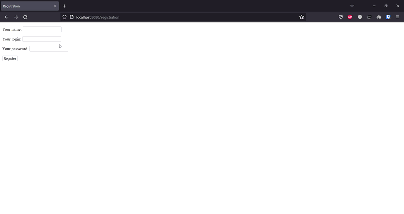

# Лабораторная работа №5: Создание системы регистрации в веб-приложении

## Задача:
> + Реализовать обработку всех исключений при регистрации

## Результат:




## Описание работы программы:

1. В функции [main](./cmd/app/main.go) происходит подключение к базе данных с помощью пакета [pg](./pkg/pg), который был написал и использован мною в другом проекте.
2. Далее происходит создание роутера с помощью стороннего фреймворка [gin](https://github.com/gin-gonic/gin) и подгрузка html-шаблонов из каталога [templates](./web/templates).
3. После чего происходит инициализация роутов по адресам:
    - -GET /login
    - -POST /login
    - -GET /registration
    - -POST /registration
4. В функции [LoginPage](./internal/handlers/login.go) происходит обработка GET-запроса по адресу /login. Она отдает готовую html-страницу с формой для ввода логина и пароля.
5. В функции [Authorization](./internal/handlers/login.go) происходит обработка POST-запроса по адресу /login. Она получает логин и пароль из формы, проверяет их на пустоту и наличие в базе данных. Если все хорошо, то отдает готовую html-страницу с аккаунтом пользователя. Если что-то не так, то формирует html-страницу с ошибкой и отдает ее.
6. В функции [RegistrationPage](./internal/handlers/registration.go) происходит обработка GET-запроса по адресу /registration. Она отдает готовую html-страницу с формой для ввода имени пользователя, логина и пароля.
7. В функции [Registration](./internal/handlers/registration.go) происходит обработка POST-запроса по адресу /registration. Она получает имя пользователя, логин и пароль из формы, проверяет их на пустоту и наличие в базе данных. Если все хорошо, то отдает готовую html-страницу с сообщением об успешной регистрации. Если что-то не так, то формирует html-страницу с ошибкой и отдает ее.

## Запуск и билд программы из исходного кода:
### С использованием Makefile:
```bash
make build && make run
```
### Без использования Makefile
```bash
go build -o bin/main ./cmd/app/main.go && GIN_MODE=release .bin/main
```
### Простой запуск программы, без сохранения бинарного файла
```bash
GIN_MODE=release go run cmd/app/main.go
```

## Примечание
+ В файле используются 2 внеших пакета: [gin](https://github.com/gin-gonic/gin) и [pgx](https://github.com/jackc/pgx/v4). Первый используется для более удобного роутинга, а второй для работы с базой данных.
+ Все необходимые зависимости указаны в файле [go.mod](./go.mod).
+ Также используется сторонний пакет [pg](./pkg/pg), который я написал и использовал в другом проекте, его не требуется устанавливать дополнительно, т.к. он уже содержится в репозитории. Он используется для того, чтобы не писать одни и те же функции для работы с базой данных в каждом проекте, а просто подключать его и использовать.
+ Готовый файл актуального билда находится в папке [bin](./bin).
+ При сборке проекта с помощью Makefile необходимо наличие установленного пакета [make](https://www.gnu.org/software/make/).
+ Также необходимо наличие установленного пакета [go](https://golang.org/).
+ Базой этого репозитория является репозиторий лабораторной работы №4.


